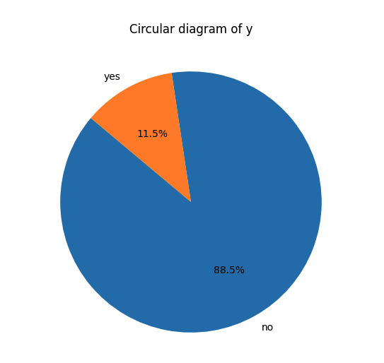
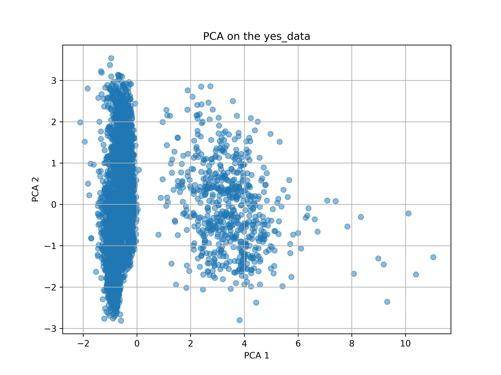
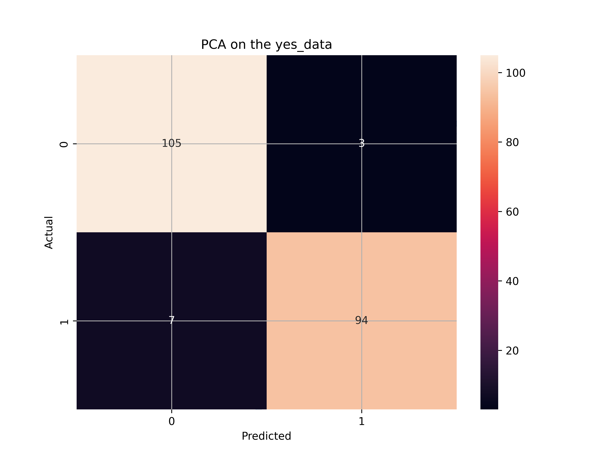

# Bank marketing: Will the client subscribe to a term deposit ?

In this branch, we develop an efficient AI-based approach to predict if the client will subscribe (yes/no) a term deposit (variable y).

## Table of Contents
- [Prerequisites](#prerequisites)
  - [Anaconda and conda environment](#anaconda-and-conda-environment)
  - [Databases](#databases)
- [Goal of the project](#goal-of-the-project)
- [Project architecture](#project-architecture)
  - [1. Load the data and vizualize the content](#1-load-the-data-and-vizualize-the-content)  
  - [2. Homogeneize the data and train a first classification model](#2-homogeneize-the-data-and-train-a-first-classification-model) 
  - [3. Studying the influence of classification models](#3-studying-the-influence-of-classification-models)  
- [Code and Jupyter notebook available](#code-and-jupyter-notebook-available)

## Prerequisites

### Anaconda

To execute the code, we will set up a specific environment using Anaconda. To install it, visit [Anaconda Installation](https://docs.anaconda.com/free/anaconda/install/).

### Setup conda environment

First, create the conda environment:
```
conda create -n myMarketAnalysis python=3.8
```

Then, activate the conda environment:
```
conda activate myMarketAnalysis
```

Once the environment is properly created, install the necessary Python libraries to execute the code:
```
pip install numpy pandas scikit-learn numpy pandas scipy
```

### Database

In this project, we take the database available on Kaggle (https://www.kaggle.com/datasets/abdelazizsami/bank-marketing/data) and put here as a copy (downloaded on 22-07-2024) and stored in the folder (Databases)[Databases]. 

## Goal of the project

***The goal of the project is to use our tools to predict, if yes or no, a client will subscribe a term deposit based on data*** 

## Project architecture

This project consists of three main tasks:

[***1. Load the data and vizualize the content***](#1-load-the-data-and-vizualize-the-content)  
[***2. Homogeneize the data and train a first classification model***](#2-homogeneize-the-data-and-train-a-first-classification-model) 
[***3. Studying the influence of classification models***](#3-studying-the-influence-of-classification-models)  

Let us see in more details these aspects.

### 1. Load the data and vizualize the content

First, we need to load the data and vizualize them. To do this task, we can use the script [1-Load-data-and-vizualize.py](1-Load-data-and-vizualize.py) by typing:

```bash
python 1-Load-data-and-vizualize.py
```
   

The code will show you how the data are sparsed. Surprinsingly, depicted on the Figure above, we can observe that most of the data are related to the "no case", which can cause a bias in our analysis. In that case, we will need to homogeneize the data in order to have an equal number between the yes and no data.

### 2. Homogeneize the data and train a first classification model

If we decide to train a model based on these data, we will overfit our data, with a very good accuracy on the "no cases" but a very poor accuracy on the "yes cases". To have more details and see how it looks like, we made it in the jupyternotebook of Kaggle, available here: https://www.kaggle.com/code/celerse/bank-marketing-features-selections-and-acc-0-99   

Here, we only focus on developing the best strategy based on the data selection. To do so:
- We first select the best "no" data based on a PCA analysis and extract the most diverse one in order to create a subset made of 50% of "yes cases" and 50% of "no cases".
- We create best features by combining the already existed features (this method comes from our previous analysis on other databases: https://github.com/Fredericcelerse/DataConsistency/tree/main)
- We train an SVM classification model based on these data
- We evaluate the accuracy and test the accuracy on the remaining "no cases" that were not included in the training/test data.

To do this task, we use the script called [2-Data-Selection-and-training.py](2-Data-Selection-and-training.py) by typing:

```bash
python 2-Data-Selection-and-training.py
```

   

First, the "no" data are projected on the 2D environment generated thanks to the PCA algorithm

   

The SVM model is trained and shows good accuracy, as depicted by the confusion matrix above and the result in the terminal:
```
Optimized Accuracy: 0.9521531100478469
Optimized Classification Report:
              precision    recall  f1-score   support

           0       0.94      0.97      0.95       108
           1       0.97      0.93      0.95       101

    accuracy                           0.95       209
   macro avg       0.95      0.95      0.95       209
weighted avg       0.95      0.95      0.95       209
```

And also for the transfer on the unknown "no" data:

```
Accuracy on remaining no_data: 0.8588674906582351
```

### 3. Studying the influence of classification models

However, while it seems to achieve a good accuracy, the result of 0.86 is strongly dependant on the random seed we are using, meaning that the result is not reproducible. For instance, if you change the seeds at the begining of the code, you will obtain another result, and this one will oscilate between 0.63 and 0.93 (from the experiments I made).

**What can you think ?**

It simply means that the data can offer a good accuracy, but that the model is not the best suitable one for this task.

**What alternative can we propose ?***

Instead of using SVM, we can resort to Random Forest classification algorithm, which are known to be less sensitive to the data quality, which is indeed one of the issue we are treating here with this database.   
To do so, we can use the script [3-RandomForest.py](3-RandomForest.py), that we can launch in our terminal as:

```bash
python 3-RandomForest.py
```

The script is doing the same tasks as [2-Data-Selection-and-training.py](2-Data-Selection-and-training.py), we just replaced the SVM part at the end by the Random Forest. We then obtain:

```
Training 1:
Optimized Accuracy: 1.0
Training 2:
Optimized Accuracy: 1.0
Training 3:
Optimized Accuracy: 1.0
Training 4:
Optimized Accuracy: 1.0
Training 5:
Optimized Accuracy: 1.0
Training 6:
Optimized Accuracy: 1.0
Training 7:
Optimized Accuracy: 1.0
Training 8:
Optimized Accuracy: 1.0
Training 9:
Optimized Accuracy: 1.0
Training 10:
Optimized Accuracy: 1.0
```

and 

```
Test 1
Accuracy on remaining no_data: 0.9896521989077322
Test 2
Accuracy on remaining no_data: 0.9905145156654211
Test 3
Accuracy on remaining no_data: 0.9902270767461915
Test 4
Accuracy on remaining no_data: 0.992239149180799
Test 5
Accuracy on remaining no_data: 0.9913768324231101
Test 6
Accuracy on remaining no_data: 0.992239149180799
Test 7
Accuracy on remaining no_data: 0.992239149180799
Test 8
Accuracy on remaining no_data: 0.9896521989077322
Test 9
Accuracy on remaining no_data: 0.992239149180799
Test 10
Accuracy on remaining no_data: 0.9896521989077322
```

We can see here that the model quality is stronger, with 10 RF modeel providing all around 99% of accuracy on the "no data" that we not used in the training/test sets. It thus highlights the benefit of using Random Forest algorithms in such cases instead of SVM !

## Code and jupyter notebook available

The jupyter notebook released on Kaggle is available here: https://www.kaggle.com/code/celerse/bank-marketing-features-selections-and-acc-0-99
If you have any comments, remarks, or questions, do not hesitate to leave a comment or to contact me directly. I would be happy to discuss it directly with you !

